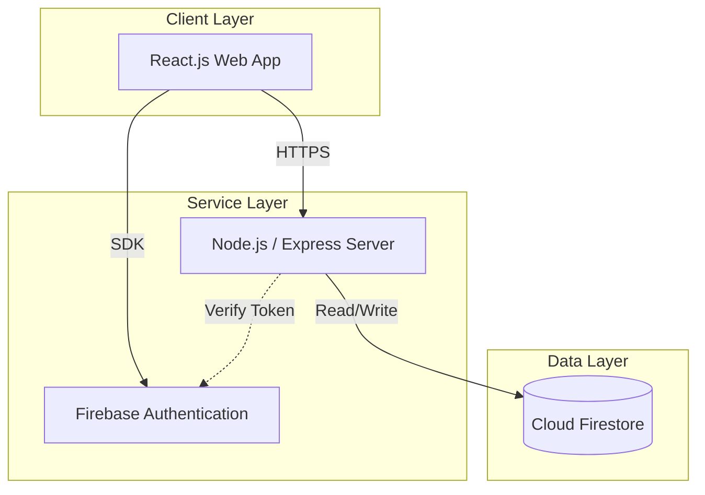
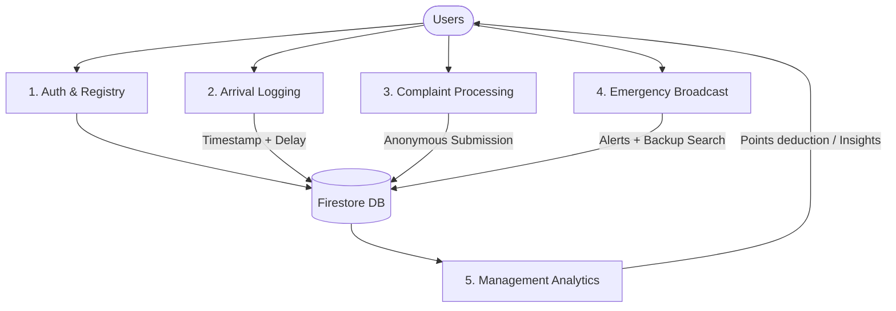
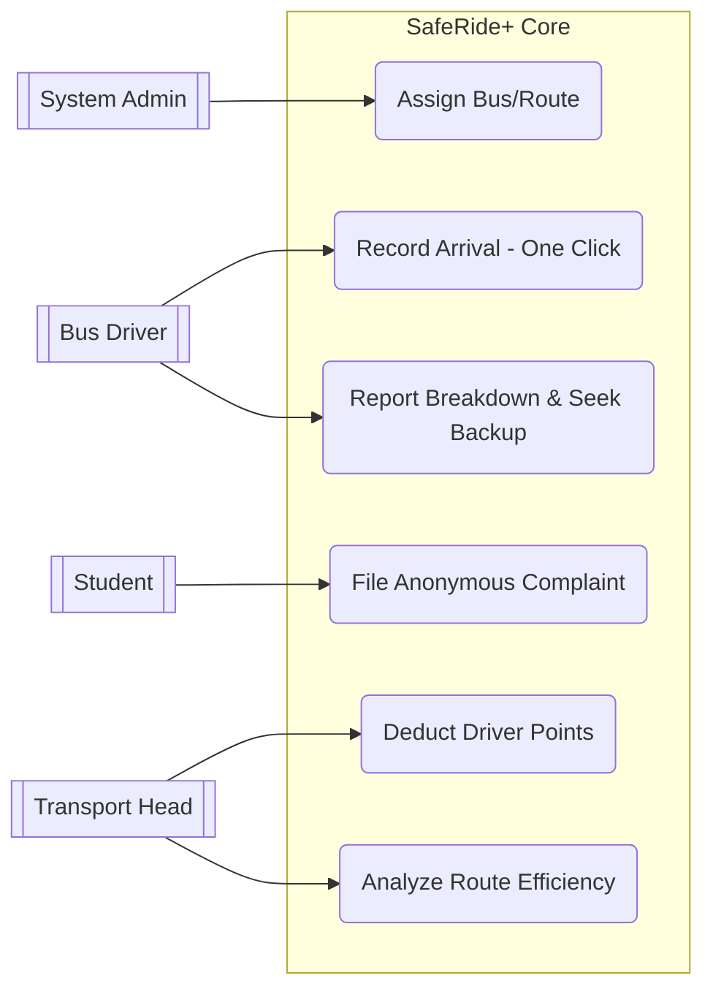
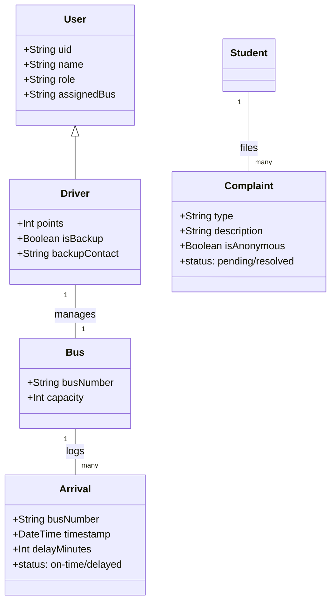
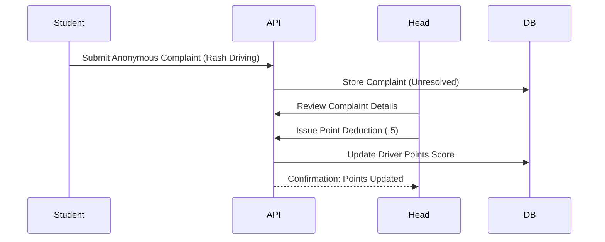
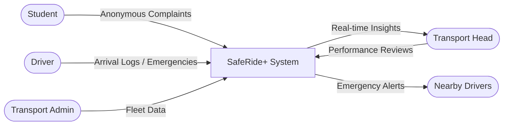
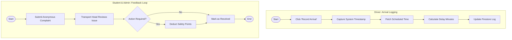

# Walkthrough - Activity Diagram Addition

I have updated the [SafeRide_PPT_Content.md](file:///c:/Users/yashc/Desktop/minnor%20project/SafeRide_PPT_Content.md) file to include the missing Activity Diagram content as requested.

## Changes Made

### [SafeRide_PPT_Content.md](file:///c:/Users/yashc/Desktop/minnor%20project/SafeRide_PPT_Content.md)
- **Added Slide 10: UML Activity Diagram**:
    - Created a comprehensive diagram using Mermaid syntax.
    - Captures the **Driver Arrival Logging** workflow (One-click recording, timestamp capture, delay calculation).
    - Captures the **Student/Admin Feedback Loop** (Anonymous complaint submission, Transport Head review, and point deduction).
- **Renumbered Slides**:
    - Updated the previous Slide 10 ("Quantitative Impact & Results") to **Slide 11** to maintain sequential order.

## Verification Results

### Manual Review
- Checked the file content to ensure correct Slide numbering.
- Verified that the Mermaid syntax for the Activity Diagram is valid and accurately reflects the project's logic found in the codebase.

```diff:SafeRide_PPT_Content.md
# SafeRide+ Project Review Presentation: Smart Bus Management

Below is the finalized, structured content for your presentation, updated with all **Phase 2** features including Driver Performance, Anonymous Complaints, and Transport Analytics.

---

## Slide 1: Problem Statement & Existing Model
- **Current Problem**: College transport systems lack real-time visibility into bus arrivals, overcrowding, and driver behavior.
- **Manual Logging**: Traditional registers for bus timings are prone to errors and tampering.
- **Safety Gaps**: No formal way for students to report issues safely (anonymously) without fear of backlash.
- **Emergency Latency**: During breakdowns, manual coordination for backup drivers causes significant student delays.
- **Grievance Inefficiency**: Transport heads lack a centralized dashboard to analyze complaints and penalize repetitive offenders.

---

## Slide 2: Proposed Solution (SafeRide+)
**SafeRide+** is a smart, real-time transport management platform designed for college campus safety and efficiency.
- **Core Strategy**: Moving from manual tracking to a **Digital Performance Ledger**.
- **Key Innovation**: One-click driver arrival logging with automated delay calculation.
- **Accountability**: A points-based safety system for drivers with manual deductions for rash driving.
- **Student Safety**: A secure, anonymous reporting portal for overcrowding and behavior issues.
- **Fleet Intelligence**: Insights-driven dashboard for identifying problematic routes and high-load buses.

---

## Slide 3: System Architecture
SafeRide+ follows a modern Cloud-Native Architecture.



---

## Slide 4: Data Flow Diagram (Level 0 - Context)


---

## Slide 5: Data Flow Diagram (Level 1)



---

## Slide 6: UML Use Case Diagram



---

## Slide 7: UML Class Diagram



---

## Slide 8: Technical Modules (Phase 2)
1. **One-Click Arrival Module**: GPS-independent logging. Computes delays automatically by comparing current time vs. planned schedule.
2. **Performance Ledger Module**: Maintains 100-point safety scores. Deducts -5 points per penalty. Links performance to driver ranking.
3. **Emergency Broadcast Module**: Scans the database for 'Backup' drivers and lists their contact info instantly during a breakdown report.
4. **Insights Engine**: Aggregates complaints filtered by 'Overcrowding' to alert the Transport Head of high-demand routes.

---

## Slide 9: UML Sequence Diagram (Performance Penalty Flow)



---

## Slide 10: Quantitative Impact & Results

| Feature | Before (Manual) | After (SafeRide+) | Benefit |
| :--- | :--- | :--- | :--- |
| **Arrival Logging** | 5 mins (manual entry) | **< 2 seconds (1-click)** | **99% Faster** |
| **Emergency response** | Call-based search | **Instant backup view** | **Zero search time** |
| **Complaint Handling** | Face-to-face (Risky) | **Anonymous Portal** | **100% Student Privacy** |
| **Fleet Monitoring** | Reactive | **Proactive Analytics** | **Early Delay Detection** |

---

**SafeRide+** effectively closes the feedback loop between students, drivers, and transport authorities, ensuring a safer and more predictable campus commute.
===
# SafeRide+ Project Review Presentation: Smart Bus Management

Below is the finalized, structured content for your presentation, updated with all **Phase 2** features including Driver Performance, Anonymous Complaints, and Transport Analytics.

---

## Slide 1: Problem Statement & Existing Model
- **Current Problem**: College transport systems lack real-time visibility into bus arrivals, overcrowding, and driver behavior.
- **Manual Logging**: Traditional registers for bus timings are prone to errors and tampering.
- **Safety Gaps**: No formal way for students to report issues safely (anonymously) without fear of backlash.
- **Emergency Latency**: During breakdowns, manual coordination for backup drivers causes significant student delays.
- **Grievance Inefficiency**: Transport heads lack a centralized dashboard to analyze complaints and penalize repetitive offenders.

---

## Slide 2: Proposed Solution (SafeRide+)
**SafeRide+** is a smart, real-time transport management platform designed for college campus safety and efficiency.
- **Core Strategy**: Moving from manual tracking to a **Digital Performance Ledger**.
- **Key Innovation**: One-click driver arrival logging with automated delay calculation.
- **Accountability**: A points-based safety system for drivers with manual deductions for rash driving.
- **Student Safety**: A secure, anonymous reporting portal for overcrowding and behavior issues.
- **Fleet Intelligence**: Insights-driven dashboard for identifying problematic routes and high-load buses.

---

## Slide 3: System Architecture
SafeRide+ follows a modern Cloud-Native Architecture.


---

## Slide 4: Data Flow Diagram (Level 0 - Context)



---

## Slide 5: Data Flow Diagram (Level 1)


---

## Slide 6: UML Use Case Diagram


---

## Slide 7: UML Class Diagram


---

## Slide 8: Technical Modules (Phase 2)
1. **One-Click Arrival Module**: GPS-independent logging. Computes delays automatically by comparing current time vs. planned schedule.
2. **Performance Ledger Module**: Maintains 100-point safety scores. Deducts -5 points per penalty. Links performance to driver ranking.
3. **Emergency Broadcast Module**: Scans the database for 'Backup' drivers and lists their contact info instantly during a breakdown report.
4. **Insights Engine**: Aggregates complaints filtered by 'Overcrowding' to alert the Transport Head of high-demand routes.

---

## Slide 9: UML Sequence Diagram (Performance Penalty Flow)


---

## Slide 10: UML Activity Diagram (Workflow)



---

## Slide 11: Quantitative Impact & Results

| Feature | Before (Manual) | After (SafeRide+) | Benefit |
| :--- | :--- | :--- | :--- |
| **Arrival Logging** | 5 mins (manual entry) | **< 2 seconds (1-click)** | **99% Faster** |
| **Emergency response** | Call-based search | **Instant backup view** | **Zero search time** |
| **Complaint Handling** | Face-to-face (Risky) | **Anonymous Portal** | **100% Student Privacy** |
| **Fleet Monitoring** | Reactive | **Proactive Analytics** | **Early Delay Detection** |

---

**SafeRide+** effectively closes the feedback loop between students, drivers, and transport authorities, ensuring a safer and more predictable campus commute.
```
